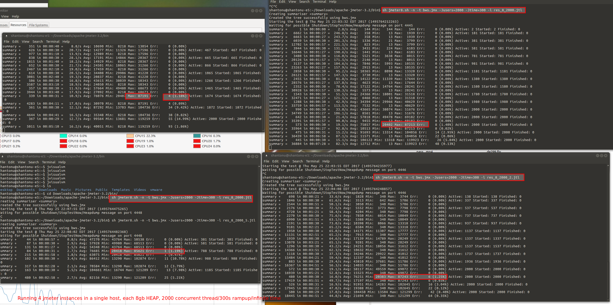

# Jmeter Test Running 
 
 # Test Data Prepration 
 1. Run the web service and 
 2. Use postman or even Jmeter to actually add some entry with POST request
 
 # Test Case 
 
 - Only View entries (20+) to web service 
 - I have added the bws.jmx
 
 #Test Command 
 - As you can see from my test case, I am running in infinite loop with 2000 concurent users with rampup 300s , 
 i put those thread & rampup in property variable so that I can play around request. 
 
 - And I am running Jmeter in command line mode. 
 
 - And I have changed the jmeter.sh (bat for windows) made my own customised jmeter.sh. I gave name jmeter8.sh. It has higher JVM heap allocation than normal JVM, here are the added parameters
 
 JVM_ARGS="-Xms2G -Xmx8G -XX:G1ReservePercent=30"
 
 only JVM parameters added 
 
 So, finally my command will be 
 
 sh jmeter8.sh -n -t bws.jmx -Jusers=2000 -Jtime=300 -l res_8_2000_.jtl
 
 Thats it, the summerizer sampler shows resutts. 

 
 
 # Test Results 
 
 
 # Analysis 
 - Total 8000 Request/s , serving peak after 5 min (300s rampup)
 - Test ran 15+ min , no problem. 
 - Break point, as soon as it get Max Response Time 85s+ then server having issues. (getting errors in all load generators) 
