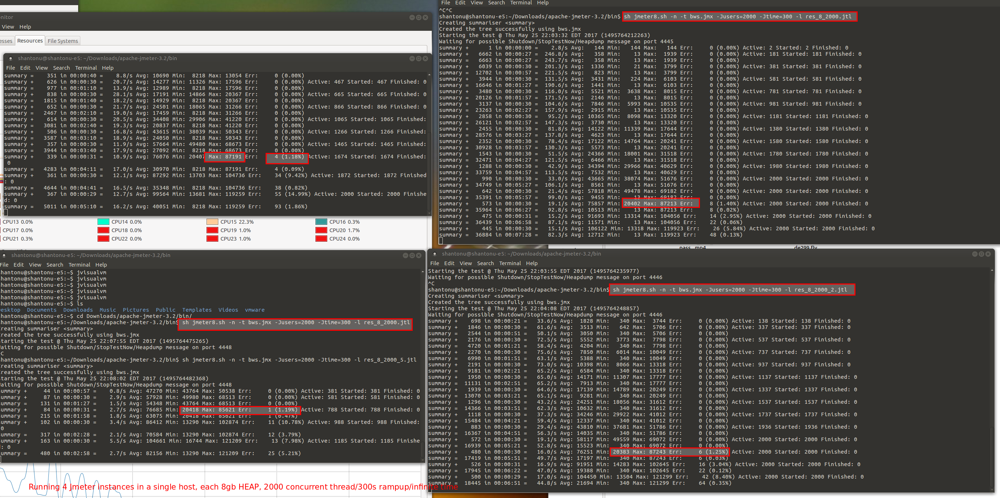

# Bug web service 
This is a small webservice for storing bug in a table. 
The main idea is to store bug in HSQLDB and use this webservice to practice REST webservice testing using tools/framework.  

# run from IDE or with code
mvn clean release 

mvn spring-boot:run

# Deploy and run from JAR
mvn clean package

=> this will generate a Jar file in target folder. The name of the jar file will be "spring-boot-webservice-1.0.SNAPSHOT.jar" 
so, you need to copy that and put in any folder you like. This is standalone runner (jetty server built in) . Now, from commandline 

java -jar <generated jar>

# URL config 
Host : localhost

Port :9100

Paths : 

1. To see all bugs : GET : /table/bugs
2. To save a bug: POST : /table/bugs
3. To see a bug : GET : /table/bugs/{id}
4. To Update a Bug: PUT : /table/bugs/{id}
5. To Delete a Bug : DELETE : /table/bugs/{id}

# Authentication 
No auth for 1.0

Basic auth for 2.0 (see credentials in application . properties) 

# Properties 
See , resources/config folder for configuration. 

# HSQL DB 
see resources/data folder

# Sample data : 

   {
     "id": 1,
     "title": "this is a bug",
     "summary": "Sample Bug" ,
     "exceptions": "Exception Is not present",
     "comments": "Comments ",
     "foundDateTime":"1st december",
     "tags": "New, On production",
     "priority": "High",
     "servility": "Blocker",
     "attachmentPath": "http://",
     "description": "Sampel Data "
   }
 
 
# Test tools 
1. postman or other browser plugins
2. Jmeter
3. soapui etc
4. IDE Plugins
5. Rest Assured 
 
 etc
 
 # Jmeter Test Running 
 
 # Test Data Prepration 
 1. Run the web service and 
 2. Use postman or even Jmeter to actually add some entry with POST request
 
 # Test Case 
 
 - Only View entries (20+) to web service 
 - I have added the bws.jmx
 
 #Test Command 
 - As you can see from my test case, I am running in infinite loop with 2000 concurent users with rampup 300s , 
 i put those thread & rampup in property variable so that I can play around request. 
 
 - And I am running Jmeter in command line mode. 
 
 - And I have changed the jmeter.sh (bat for windows) made my own customised jmeter.sh. I gave name jmeter8.sh. It has higher JVM heap allocation than normal JVM, here are the added parameters
 
 JVM_ARGS="-Xms2G -Xmx8G -XX:G1ReservePercent=30"
 
 only JVM parameters added 
 
 So, finally my command will be 
 
 sh jmeter8.sh -n -t bws.jmx -Jusers=2000 -Jtime=300 -l res_8_2000_.jtl
 
 Thats it, the summerizer sampler shows resutts. 

 
 
 # Test Results 
 
 
 # Analysis 
 - Total 8000 Request/s , serving peak after 5 min (300s rampup)
 - Test ran 15+ min , no problem. 
 - Break point, as soon as it get Max Response Time 85s+ then server having issues. (getting errors in all load generators) 
